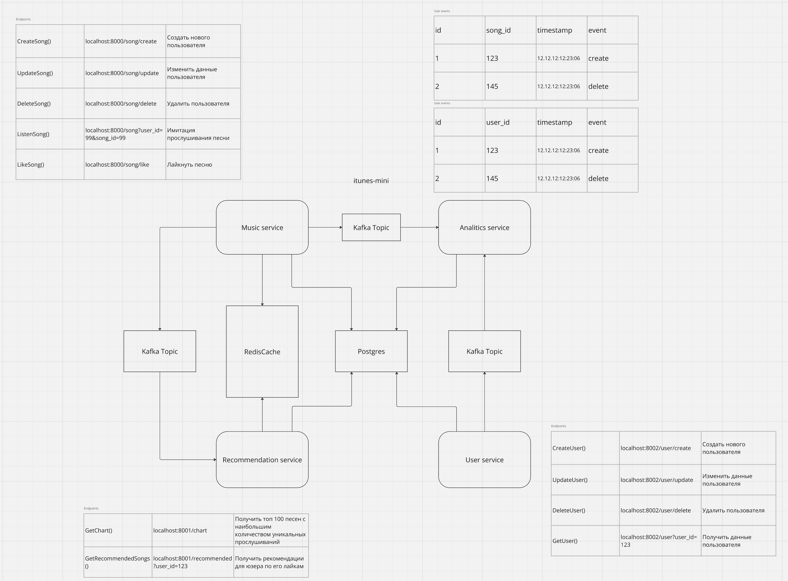
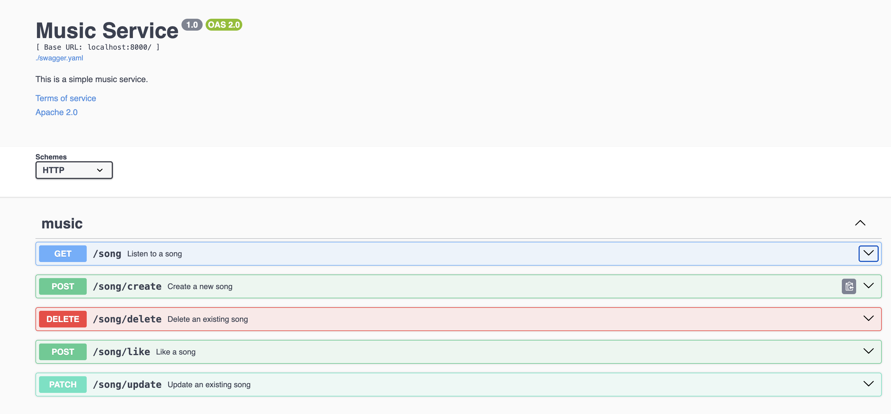
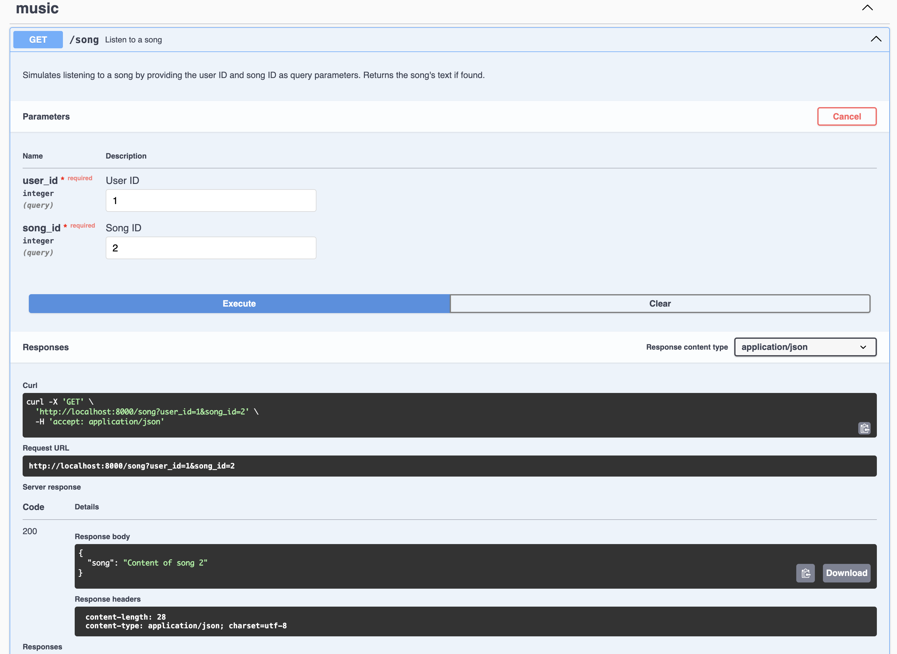
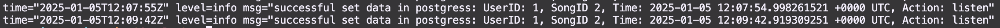

# Краткий обзор проекта

- Данный проект представляет из себя сервис музыки на минималках, состоящий из четырех микросервисов:
 1) Сервис пользователей
 2) Сервис музыки
 3) Севрсив рекомендаций
 4) Сервис аналитики

 - Сервис пользователей способен создавать/удалять пользователя, а также обновлять/получать информацию пользователя.
   При создании, апгрейде и удалении пользователя, сервис юзеров отправляет сообщение в Кафку об этих действиях для 
   последующей аналитики.

 - Сервис музыки позволяет создать/изменить/удалить песню, а также "прослушать" и поставить лайк.
   При создании/изменении/удалении песни, сервис отправляет сообщение в Кафку об этих действиях для 
   последующей аналитики.
   При "прослушивании" песни и установки лайка, сервис музыки отправляет сообщение в Кафку об этом для вычисления 
   рекомендаций песен для юзеров.

 - Сервис рекомендаций выдает пользователям список рекомендованных песен по двум алгоритмам.
   Первый - музыкальный чарт. Вычисляется на основе уникальных прослушиваний всех пользователей. Выдает топ 100 самых популярных песен за последний месяц.
   Второй - второй рекомендательные треки для конкретного юзера, вычисляется за счет лайков. Выдает топ 50 самых подходящих треков, которые пользователь еще не слушал. Вычисляется следующим путем: смотрим, что лайкал юзер, смотрим
   какие юзеры лайкали этот же трек, смотрим какие треки лайкали они, выбираем из них самые залайканные, попутно отсекая те,что юзер уже слушал, возвращаем топ 50.

 - Сервис аналитики не имеет эндпоинтов и представляет из себя консьюмер, который слушает сервисы музыки и юзеров, 
   отслеживая их активности. Эти данные могут использовать аналитики для вычесления статистики активности 
   в обоих сервисах.

 - Кэш используется в сервисах музыки и рекомендаций. В первом случае - для хранения прослушанных песен, во втором - 
   для хранения рекомендаций. Данные хранятся в кэше 24 часа. В случае если редис по каким-то причинам отвалится, информация об этом появится в логах, а сервисы будут ходить за информацией в постгрес.

 - Логирование данных происходит на этапах запуска микросервисов, при ошибках, а также при возвращении данных из кэша и успешном приеме сообщения из топиков.

# Инструкция для тестирования

- Запускаем make. Ожидаем когда поднимутся контейнеры.
- Проверяем, что все заработало (docker ps).
- Отрываем бразуер и переходим по адресам: http://localhost:8080/ http://localhost:8070/ http://localhost:8090/ .
- Перед нами представлены эндпоинты с кратким описанием, а также возможными ретернами:

- Для того, чтобы убедиться, что данные взяты из кэша или ушли в кафку, можно посмотреть логи сервисов.
- Ниже приведен пример кейса прослушивания трека с айди=2 юзером с айди=1. Слушать он его будет два раза подряд.

- Далее зайдем в логи (docker logs music_service) и убедимся, что во втором случае, трек был получен из рэдиса:

- Также зайдем в логи сервиса рекомендаций (docker logs recommendation_service) и убедимся, что он успешно получил информацию из топика:

- По аналогии можно протестировать все ручки сервисов
- ВАЖНО! В миграцию добавлены тестовые данные для тестировки GET запросов в частности рекомендаций, чтобы они не возвращали NULL при пустой базе.
